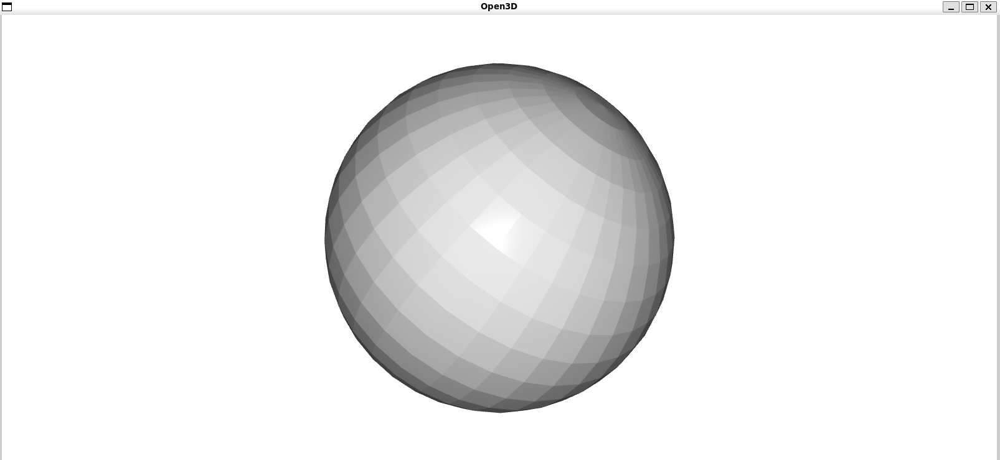

# Setup Common 3D libraries in WSL2 on Win11

WSL with Ubuntu 20.04
## 1. CUDA toolkits
```bash
# Install CUDA 11.8 toolkits
wget https://developer.download.nvidia.com/compute/cuda/repos/wsl-ubuntu/x86_64/cuda-wsl-ubuntu.pin
sudo mv cuda-wsl-ubuntu.pin /etc/apt/preferences.d/cuda-repository-pin-600

sudo apt-key adv --fetch-keys https://developer.download.nvidia.com/compute/cuda/repos/wsl-ubuntu/x86_64/3bf863cc.pub
sudo add-apt-repository "deb https://developer.download.nvidia.com/compute/cuda/repos/wsl-ubuntu/x86_64/ /"

# install CUDA 11.8
sudo apt update
sudo apt install cuda-toolkit-11-8

# update env variables
echo 'export PATH=/usr/local/cuda-11.8/bin:$PATH' >> ~/.bashrc
echo 'export LD_LIBRARY_PATH=/usr/local/cuda-11.8/lib64:$LD_LIBRARY_PATH' >> ~/.bashrc
source ~/.bashrc

# Test
nvcc --version
nvidia-smi

```

## 2. Open3D
In side the conda environment
```bash
# normally open3d will cause segmentation fault during visualization
# following the solution provided in https://github.com/isl-org/Open3D/issues/6872#issuecomment-2615797521

export XDG_SESSION_TYPE=x11
# or
echo 'export XDG_SESSION_TYPE=x11' >> ~/.bashrc

# Test
python -c "import open3d as o3d; mesh=o3d.geometry.TriangleMesh.create_sphere(); mesh.compute_vertex_normals(); o3d.visualization.draw_geometries([mesh])"

```
This test case can display the following window


## 3. Key library verification
```bash
# check cuda correctly recognized by pytorch
python -c "import torch; print('CUDA is available: ', torch.cuda.is_available())"

# check matplotlib can show interactive window on host machine
python -c "import matplotlib.pyplot as plt; plt.plot([1,2,3]); plt.show()"

# check open3d can show interactive window on host machine
python -c "import open3d as o3d; mesh=o3d.geometry.TriangleMesh.create_sphere(); mesh.compute_vertex_normals(); o3d.visualization.draw_geometries([mesh])"
```
